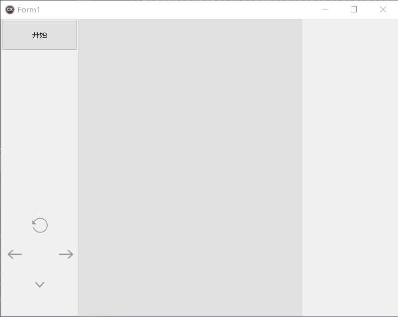
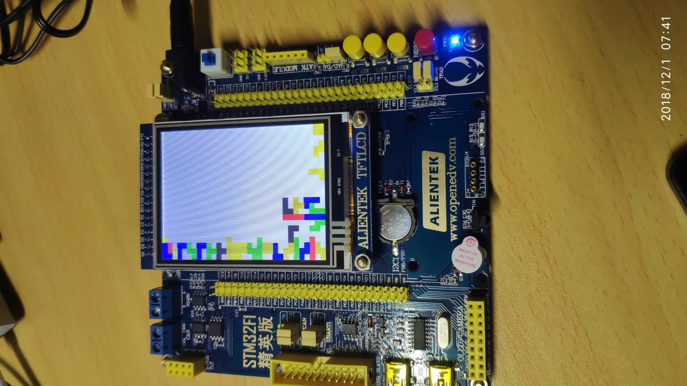

# CrossPlatformTetris
跨平台俄罗斯方块

## Firemonkey Multi-Device
一套代码可以生成Android、win32、win64、OS X、iOS、Linux等多个平台的原生应用。

## STM32
移植到STM32F103ZET6，显示在LCD上，可以用板载按键和红外遥控器操作。

## SoC
移植到DE1-SoC开发板，通过VGA显示在液晶屏上。
